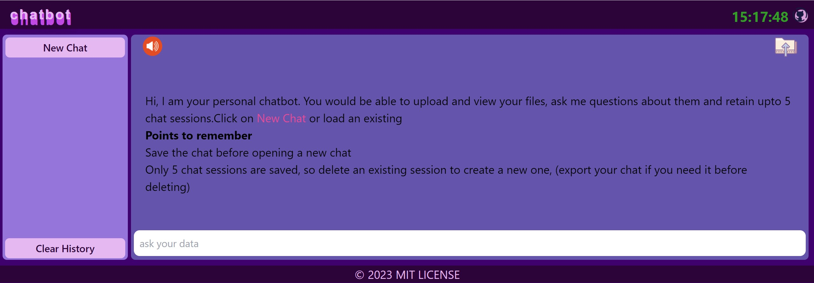
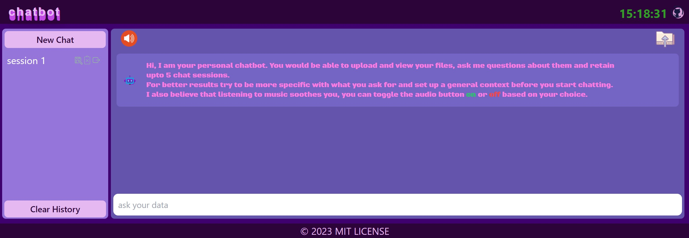
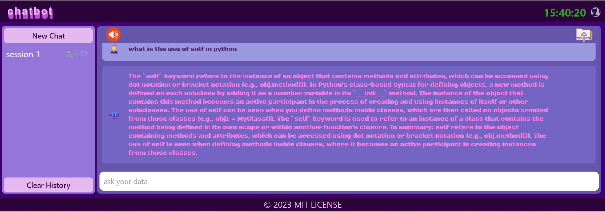
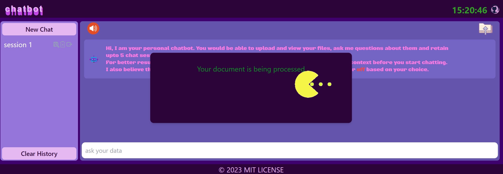
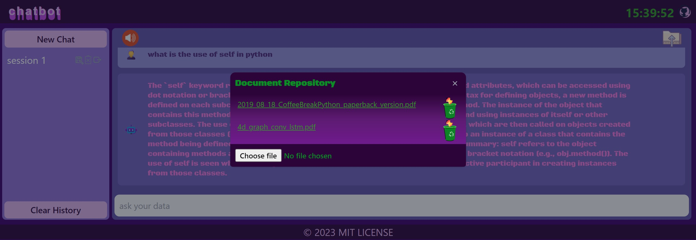

# text-to-sql

llama + SQL + PyGWalker + Flask

## Table of Contents

- [About](#about)
- [Screenshots](#screenshots)
- [Installation](#installation)

## About

A personally hosted chatbot that can answer questions based on the data it has. You will be able to add, view and delete files(PDFs, CSVs and TXTs) from the UI. <u>NOTE: When a file is deleted the corresponding embeddings are also deleted</u>, so be sure whether you don't want that data to be considered by the model. A maximum of 5 chat sessions can be saved at a time. You will be able to save, delete and export the chat when needed. Be sure to save the chat before switching to a new session. You can also toggle the background music on/off. 
Upload the document, wait for the vectorization to complete, create a session, type your query and hit enter.
The application uses **gpt4all-groovy** model and can run on CPU (time taken to query the output varies depending on the hardware though).  
You can download the model from [here](https://huggingface.co/dnato/ggml-gpt4all-j-v1.3-groovy.bin/tree/main)

## Screenshots







## Installation

  
```bash

# Clone the repository
git  clone  https://github.com/raghujhts13/private-chatbot.git

# change directory to where files are present
cd private-chatbot
# install the required libraries using the requirements.txt
pip  install  -r  requirements.txt

# start the application
python app.py
```
**configure the .env file**
*MODEL_PATH* - path where you have the model downloaded
*MODEL_TYPE* - llama.cpp or gpt4all ( change the model accordingly)
*EMBEDDINGS_MODEL_NAME* - embedding to use
*json_file_path* - where the chat histories are stored
*OUTPUT_PATH* - where a particular chat session can be stored

You can access the application at [http://127.0.0.1:5000](http://127.0.0.1:5000/) (if this is the port where the application is running)
If you are unable to do the above, check the command prompt to fetch the URL of the flask server.

